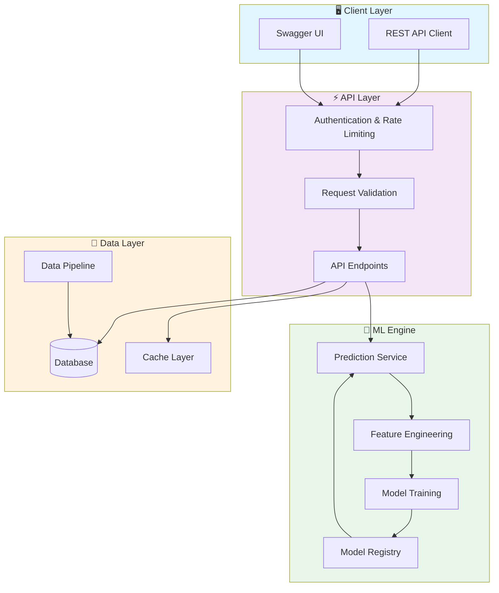
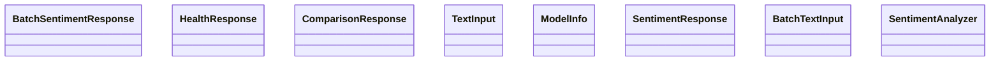

# 🔄 Nlp Sentiment Analysis Pipeline

> Professional Python project implementing Nlp Sentiment Analysis Pipeline

[](https://img.shields.io/badge/)
[](https://img.shields.io/badge/)
[](https://img.shields.io/badge/)
[](https://img.shields.io/badge/)
[](https://img.shields.io/badge/)
[](https://img.shields.io/badge/)
[](https://img.shields.io/badge/)
[](https://img.shields.io/badge/)
[](LICENSE)

[English](#english) | [Português](#português)

---

## English

### 🎯 Overview

**Nlp Sentiment Analysis Pipeline** is a production-grade Python application that showcases modern software engineering practices including clean architecture, comprehensive testing, containerized deployment, and CI/CD readiness.

The codebase comprises **840 lines** of source code organized across **12 modules**, following industry best practices for maintainability, scalability, and code quality.

### ✨ Key Features

- **🔄 Data Pipeline**: Scalable ETL with parallel processing
- **✅ Data Validation**: Schema validation and quality checks
- **📊 Monitoring**: Pipeline health metrics and alerting
- **🔧 Configurability**: YAML/JSON-based pipeline configuration
- **🗣️ Text Processing**: Tokenization, stemming, and lemmatization
- **📊 Sentiment Analysis**: Multi-language sentiment classification
- **🔍 Named Entity Recognition**: Entity extraction and classification
- **📈 Text Analytics**: TF-IDF, word embeddings, and topic modeling

### 🏗️ Architecture





### 📡 API Endpoints

| Method | Endpoint | Description |
|--------|----------|-------------|
| `GET` | `/` | Retrieve resource (list/create) |
| `GET` | `/health` | Retrieve Health |
| `GET` | `/model/info` | Retrieve Model → Info |
| `POST` | `/predict` | Create Predict |
| `POST` | `/batch_predict` | Create Batch Predict |
| `POST` | `/explain` | Create Explain |

### 🚀 Quick Start

#### Prerequisites

- Python 3.12+
- pip (Python package manager)
- Docker and Docker Compose (optional)

#### Installation

```bash
# Clone the repository
git clone https://github.com/galafis/nlp-sentiment-analysis-pipeline.git
cd nlp-sentiment-analysis-pipeline

# Create and activate virtual environment
python -m venv venv
source venv/bin/activate  # On Windows: venv\Scripts\activate

# Install dependencies
pip install -r requirements.txt
```

#### Running

```bash
# Run the application
python src/api/app.py
```

### 🐳 Docker

```bash
# Build the Docker image
docker build -t nlp-sentiment-analysis-pipeline .

# Run the container
docker run -d -p 8000:8000 --name nlp-sentiment-analysis-pipeline nlp-sentiment-analysis-pipeline

# View logs
docker logs -f nlp-sentiment-analysis-pipeline

# Stop and remove
docker stop nlp-sentiment-analysis-pipeline && docker rm nlp-sentiment-analysis-pipeline
```

### 🧪 Testing

```bash
# Run all tests
pytest

# Run with coverage report
pytest --cov --cov-report=html

# Run specific test module
pytest tests/test_main.py -v

# Run with detailed output
pytest -v --tb=short
```

### 📁 Project Structure

```
nlp-sentiment-analysis-pipeline/
├── assets/
├── data/
│   ├── processed/
│   └── raw/
├── models/        # Data models
├── notebooks/
├── reports/
│   └── figures/
├── src/          # Source code
│   ├── api/           # API endpoints
│   │   ├── __init__.py
│   │   └── app.py
│   ├── data/
│   │   └── __init__.py
│   ├── features/
│   │   └── __init__.py
│   ├── models/        # Data models
│   │   ├── __init__.py
│   │   └── sentiment_analyzer.py
│   ├── utils/         # Utilities
│   │   └── __init__.py
│   ├── visualization/
│   │   └── __init__.py
│   └── __init__.py
├── tests/         # Test suite
│   ├── __init__.py
│   └── test_models.py
├── Dockerfile
├── LICENSE
├── README.md
├── README_OLD.md
├── requirements.txt
└── setup.py
```

### 🛠️ Tech Stack

| Technology | Description | Role |
|------------|-------------|------|
| **Python** | Core Language | Primary |
| **Docker** | Containerization platform | Framework |
| **FastAPI** | High-performance async web framework | Framework |
| **MLflow** | ML lifecycle management | Framework |
| **NumPy** | Numerical computing | Framework |
| **Pandas** | Data manipulation library | Framework |
| **Plotly** | Interactive visualization | Framework |
| **scikit-learn** | Machine learning library | Framework |

### 🚀 Deployment

#### Cloud Deployment Options

The application is containerized and ready for deployment on:

| Platform | Service | Notes |
|----------|---------|-------|
| **AWS** | ECS, EKS, EC2 | Full container support |
| **Google Cloud** | Cloud Run, GKE | Serverless option available |
| **Azure** | Container Instances, AKS | Enterprise integration |
| **DigitalOcean** | App Platform, Droplets | Cost-effective option |

```bash
# Production build
docker build -t nlp-sentiment-analysis-pipeline:latest .

# Tag for registry
docker tag nlp-sentiment-analysis-pipeline:latest registry.example.com/nlp-sentiment-analysis-pipeline:latest

# Push to registry
docker push registry.example.com/nlp-sentiment-analysis-pipeline:latest
```

### 🤝 Contributing

Contributions are welcome! Please feel free to submit a Pull Request. For major changes, please open an issue first to discuss what you would like to change.

1. Fork the project
2. Create your feature branch (`git checkout -b feature/AmazingFeature`)
3. Commit your changes (`git commit -m 'Add some AmazingFeature'`)
4. Push to the branch (`git push origin feature/AmazingFeature`)
5. Open a Pull Request

### 📄 License

This project is licensed under the MIT License - see the [LICENSE](LICENSE) file for details.

### 👤 Author

**Gabriel Demetrios Lafis**
- GitHub: [@galafis](https://github.com/galafis)
- LinkedIn: [Gabriel Demetrios Lafis](https://linkedin.com/in/gabriel-demetrios-lafis)

---

## Português

### 🎯 Visão Geral

**Nlp Sentiment Analysis Pipeline** é uma aplicação Python de nível profissional que demonstra práticas modernas de engenharia de software, incluindo arquitetura limpa, testes abrangentes, implantação containerizada e prontidão para CI/CD.

A base de código compreende **840 linhas** de código-fonte organizadas em **12 módulos**, seguindo as melhores práticas do setor para manutenibilidade, escalabilidade e qualidade de código.

### ✨ Funcionalidades Principais

- **🔄 Data Pipeline**: Scalable ETL with parallel processing
- **✅ Data Validation**: Schema validation and quality checks
- **📊 Monitoring**: Pipeline health metrics and alerting
- **🔧 Configurability**: YAML/JSON-based pipeline configuration
- **🗣️ Text Processing**: Tokenization, stemming, and lemmatization
- **📊 Sentiment Analysis**: Multi-language sentiment classification
- **🔍 Named Entity Recognition**: Entity extraction and classification
- **📈 Text Analytics**: TF-IDF, word embeddings, and topic modeling

### 🏗️ Arquitetura


### 📡 API Endpoints

| Method | Endpoint | Description |
|--------|----------|-------------|
| `GET` | `/` | Retrieve resource (list/create) |
| `GET` | `/health` | Retrieve Health |
| `GET` | `/model/info` | Retrieve Model → Info |
| `POST` | `/predict` | Create Predict |
| `POST` | `/batch_predict` | Create Batch Predict |
| `POST` | `/explain` | Create Explain |

### 🚀 Início Rápido

#### Prerequisites

- Python 3.12+
- pip (Python package manager)
- Docker and Docker Compose (optional)

#### Installation

```bash
# Clone the repository
git clone https://github.com/galafis/nlp-sentiment-analysis-pipeline.git
cd nlp-sentiment-analysis-pipeline

# Create and activate virtual environment
python -m venv venv
source venv/bin/activate  # On Windows: venv\Scripts\activate

# Install dependencies
pip install -r requirements.txt
```

#### Running

```bash
# Run the application
python src/api/app.py
```

### 🐳 Docker

```bash
# Build the Docker image
docker build -t nlp-sentiment-analysis-pipeline .

# Run the container
docker run -d -p 8000:8000 --name nlp-sentiment-analysis-pipeline nlp-sentiment-analysis-pipeline

# View logs
docker logs -f nlp-sentiment-analysis-pipeline

# Stop and remove
docker stop nlp-sentiment-analysis-pipeline && docker rm nlp-sentiment-analysis-pipeline
```

### 🧪 Testing

```bash
# Run all tests
pytest

# Run with coverage report
pytest --cov --cov-report=html

# Run specific test module
pytest tests/test_main.py -v

# Run with detailed output
pytest -v --tb=short
```

### 📁 Estrutura do Projeto

```
nlp-sentiment-analysis-pipeline/
├── assets/
├── data/
│   ├── processed/
│   └── raw/
├── models/        # Data models
├── notebooks/
├── reports/
│   └── figures/
├── src/          # Source code
│   ├── api/           # API endpoints
│   │   ├── __init__.py
│   │   └── app.py
│   ├── data/
│   │   └── __init__.py
│   ├── features/
│   │   └── __init__.py
│   ├── models/        # Data models
│   │   ├── __init__.py
│   │   └── sentiment_analyzer.py
│   ├── utils/         # Utilities
│   │   └── __init__.py
│   ├── visualization/
│   │   └── __init__.py
│   └── __init__.py
├── tests/         # Test suite
│   ├── __init__.py
│   └── test_models.py
├── Dockerfile
├── LICENSE
├── README.md
├── README_OLD.md
├── requirements.txt
└── setup.py
```

### 🛠️ Stack Tecnológica

| Tecnologia | Descrição | Papel |
|------------|-----------|-------|
| **Python** | Core Language | Primary |
| **Docker** | Containerization platform | Framework |
| **FastAPI** | High-performance async web framework | Framework |
| **MLflow** | ML lifecycle management | Framework |
| **NumPy** | Numerical computing | Framework |
| **Pandas** | Data manipulation library | Framework |
| **Plotly** | Interactive visualization | Framework |
| **scikit-learn** | Machine learning library | Framework |

### 🚀 Deployment

#### Cloud Deployment Options

The application is containerized and ready for deployment on:

| Platform | Service | Notes |
|----------|---------|-------|
| **AWS** | ECS, EKS, EC2 | Full container support |
| **Google Cloud** | Cloud Run, GKE | Serverless option available |
| **Azure** | Container Instances, AKS | Enterprise integration |
| **DigitalOcean** | App Platform, Droplets | Cost-effective option |

```bash
# Production build
docker build -t nlp-sentiment-analysis-pipeline:latest .

# Tag for registry
docker tag nlp-sentiment-analysis-pipeline:latest registry.example.com/nlp-sentiment-analysis-pipeline:latest

# Push to registry
docker push registry.example.com/nlp-sentiment-analysis-pipeline:latest
```

### 🤝 Contribuindo

Contribuições são bem-vindas! Sinta-se à vontade para enviar um Pull Request.

### 📄 Licença

Este projeto está licenciado sob a Licença MIT - veja o arquivo [LICENSE](LICENSE) para detalhes.

### 👤 Autor

**Gabriel Demetrios Lafis**
- GitHub: [@galafis](https://github.com/galafis)
- LinkedIn: [Gabriel Demetrios Lafis](https://linkedin.com/in/gabriel-demetrios-lafis)
